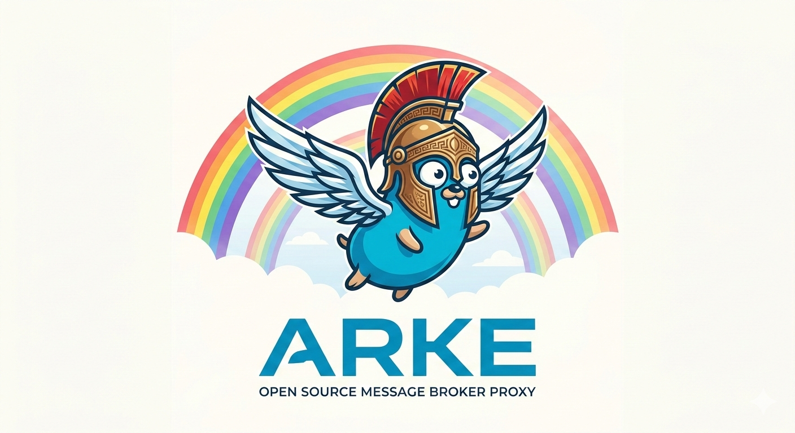

# 

## Overview

Arke is a message broker proxy with a gRPC front-end interface that supports
pluggable back-end message brokers. Currently supported: **AMQP 0.9.1**
(e.g. RabbitMQ, including RabbitMQ Streams).

> In Greek mythology, Arke is the messenger for the Titans and is sometimes
> affiliated with the faded second rainbow seen in the shadow of the first.
> [Wikipedia: Arke](https://en.wikipedia.org/wiki/Arke)

Arke lets your application talk to a single gRPC interface while Arke handles
the broker-specific protocol on the back end. Swapping or upgrading a message
broker does not require changes to your application. This abstraction also gives
operators centralized control over which broker features are exposed and
how they are used, without requiring modifications to individual applications.

```text
Your Application
     │  gRPC
     ▼
  [ Arke ]
     │  AMQP 0.9.1 / Streams
     ▼
 Message Broker
 (e.g., RabbitMQ)
```

## Table of Contents

- [Features](#features)
- [Requirements](#requirements)
- [Installation](#installation)
- [Configuration](#configuration)
- [Running](#running)
- [gRPC API](#grpc-api)
- [TLS](#tls)
- [Rate Limiting](#rate-limiting)
- [Observability](#observability)
- [Development](#development)
- [Design Documentation](#design-documentation)
- [Contributing](#contributing)
- [License](#license)
- [Third-party dependencies](#third-party-dependencies)

---

## Features

- **gRPC front-end** – `Producer`, `Consumer`, and `Healthz` services.
- **Pluggable back-end providers** – Register new broker types without
  changing the API.
- **AMQP 0.9.1 support** – Full publish, consume, ack/nack, retry, and
  dead-letter workflows. RabbitMQ Streams are supported as a target type.
- **TLS** – Optional TLS on the gRPC listener with configurable
  certificate paths.
- **Rate limiting** – Per-client token-bucket rate limiter applied to
  `Connect`, `Publish`, and `Consume` RPCs.
- **Prometheus metrics** – HTTP metrics endpoint served on the same port
  as gRPC via connection multiplexing.
- **OpenTelemetry tracing** – Trace context propagated through all RPCs
  and forwarded to an OTLP gRPC collector.
- **Health service** – Standard gRPC health protocol plus a bidirectional
  `Healthz` stream that reports CPU/memory availability.
- **Message deduplication** – `publish_id` + `publisher_name` fields on
  `Message` enable deduplication on Streams.
- **Kubernetes awareness** – Monitors HPA replica counts and broadcasts
  `GOAWAY` health signals to clients when scaling up.
- **Source options** – Per-subscription options including `MessageTTL`,
  `Expires`, `DeadLetterAddress`, `DeadLetterSubject`, `Offset`, and
  `ConsumerGroup`.
- **Header filtering** – `Filter`/`Match` messages on source subscriptions
  for server-side message filtering.

---

## Requirements

- **Go 1.25+**
- A running AMQP 0.9.1-compatible broker (e.g.,
  [RabbitMQ](https://www.rabbitmq.com/)) for back-end connectivity.
- `protoc` + `protoc-gen-go` + `protoc-gen-go-grpc` – only required if
  regenerating protobuf files.
- `golangci-lint` – only required for linting.
- Docker + Docker Compose – only required for integration tests.

---

## Installation

### Build from Source

```bash
# Clone the repository
git clone <repo-url>
cd arke

# Build for your current platform
make build

# Or build for a specific platform
make linux    # → build/linux/arke
make darwin   # → build/darwin/arke
make windows  # → build/windows/arke

# Build for all platforms
make all
```

---

## Configuration

Arke is configured entirely through environment variables.

### Core

<!-- markdownlint-disable MD013 -->
| Variable         | Default  | Description                                                                                         |
| ---------------- | -------- | --------------------------------------------------------------------------------------------------- |
| `ARKE_PORT`      | `50051`  | TCP port Arke listens on for both gRPC and HTTP (Prometheus).                                       |
| `ARKE_CERT_FILE` | _(none)_ | Path to the PEM-encoded TLS certificate file. Required together with `ARKE_CERT_KEY` to enable TLS. |
| `ARKE_CERT_KEY`  | _(none)_ | Path to the PEM-encoded TLS private key file.                                                       |

> For the complete environment variable reference — including rate limiting, TLS, and observability variables — see the [Deployment and Operations Runbook](doc/design/deployment-operations-runbook.md#environment-variables-reference).
<!-- markdownlint-enable MD013 -->

---

## Running

<!-- markdownlint-disable MD013 -->
```bash
# Minimal – plain TCP, no TLS, no rate limiting
ARKE_PORT=50051 ./build/darwin/arke

# With TLS
ARKE_CERT_FILE=/path/to/cert.pem ARKE_CERT_KEY=/path/to/key.pem ./build/darwin/arke

# CPU and heap profiling
./build/darwin/arke --cpuprofile cpu.out --memprofile mem.out
```
<!-- markdownlint-enable MD013 -->

The process handles `SIGINT` (Ctrl-C) for a graceful shutdown.

---

## gRPC API

The protobuf specification lives in
[api/protobuf-spec/arke.proto](api/protobuf-spec/arke.proto).
Generated protocol documentation is in
[doc/arke_protocol.md](doc/arke_protocol.md).

Arke exposes three gRPC services (Producer, Consumer, and Healthz). Please
see protocol documentation for details.

---

## TLS

### Server (Arke listener)

Set `ARKE_CERT_FILE` and `ARKE_CERT_KEY` to enable TLS on the gRPC
listener. The listener uses `h2` and `http/1.1` ALPN protocols so that
both gRPC and the Prometheus HTTP endpoint remain accessible on the same
port.

### Back-end (Broker connection)

Pass `tls: true` (and optionally `ca_certificate` bytes) in
`ConnectionConfiguration` when calling `Connect`. Arke will use the
provided CA certificate for verification, or fall back to the system
trust store if none is provided.
Set `ARKE_TRUSTED_CA_CERTIFICATES_PEM_FILE` to supply additional
trusted CA certificates globally at the process level.

Use `--tls-skip-verify` to disable certificate verification entirely
(not recommended for production).

<!-- markdownlint-disable-next-line MD013 -->
For Kubernetes TLS secret mount and certificate rotation guidance, see the [Deployment and Operations Runbook](doc/design/deployment-operations-runbook.md#tls-certificates-secret-mount).

---

## Rate Limiting

Arke implements a per-client token-bucket rate limiter applied to the
`Connect`, `Publish`, and `Consume` RPCs. Each client consumes one token
per call; the bucket refills on a configurable interval. By default
(`ARKE_RATE_LIMIT_ENFORCED=false`) violations are logged but allowed —
set `ARKE_RATE_LIMIT_ENFORCED=true` to reject over-limit requests with
`RESOURCE_EXHAUSTED`.

<!-- markdownlint-disable-next-line MD013 -->
See the [Deployment and Operations Runbook](doc/design/deployment-operations-runbook.md#rate-limiting) for the full variable reference and tuning guidance.

---

## Observability

- **Prometheus metrics** – Available over HTTP on the same port as gRPC
  via `cmux`. Scrape endpoint: `http://<host>:<port>/metrics`
- **OpenTelemetry tracing** – Traces exported via OTLP gRPC to
  `OTEL_EXPORTER_OTLP_ENDPOINT` (default `localhost:4317`). Disable with
  `OTEL_SDK_DISABLED=true`.
- **Health check** – Standard `grpc.health.v1.Health` for Kubernetes
  probes, plus a custom `Healthz` bidirectional stream that reports
  CPU/memory availability and emits `GOAWAY` signals during HPA scale-up.

<!-- markdownlint-disable-next-line MD013 -->
For alert thresholds, key metric names, tracing header formats, and Kubernetes probe configuration see the [Deployment and Operations Runbook](doc/design/deployment-operations-runbook.md#metrics-tracing-and-health).

---

## Development

### Running Unit Tests

```bash
make test
```

This runs `golangci-lint` followed by all unit tests with coverage output.
An HTML coverage report is written to `coverage.html`.

### Running Integration Tests

Integration tests require Docker and Docker Compose and spin up a
RabbitMQ container.

<!-- markdownlint-disable MD013 -->
```bash
# Build Arke for Linux and start RabbitMQ + Arke via Docker Compose, then run tests
make integration

# TLS variant
make integration_test_tls

# All integration test variants
make integration_all
```
<!-- markdownlint-enable MD013 -->

### Regenerating Protocol Buffers

```bash
make generate
```

Requires `protoc`, `protoc-gen-go`, and `protoc-gen-go-grpc`. Generated
files are written to [api/](api/). Documentation is regenerated to
[doc/arke_protocol.md](doc/arke_protocol.md) if `protoc-gen-doc` is also
installed.

### Linting

```bash
make lint
```

### Makefile Targets

Run `make help` for a complete list of available targets.

---

## Design Documentation

Detailed design and operational documents live in [`doc/design/`](doc/design/).

<!-- markdownlint-disable MD013 -->
| Document | Description |
| --- | --- |
| [Architecture Overview](doc/design/architecture-overview.md) | Component map, data-flow diagrams, key design decisions, and repository structure |
| [Connection and Message Lifecycle](doc/design/connection-message-lifecycle.md) | Detailed session phases, goroutine topology, ack/nack state machine, and GOAWAY flow |
| [Provider/Connector Interface Contract](doc/design/provider-connector-interface.md) | Interface specification and guide for adding new broker backends |
| [Deployment and Operations Runbook](doc/design/deployment-operations-runbook.md) | Full environment variable reference, Kubernetes deployment checklist, observability setup, and troubleshooting |
| [Protocol Reference](doc/arke_protocol.md) | Auto-generated reference for all protobuf messages, fields, enums, and gRPC service methods |
<!-- markdownlint-enable MD013 -->

---

## Contributing

Maintainers are accepting patches and contributions to this project.
Please read [CONTRIBUTING.md](CONTRIBUTING.md) for details about submitting
contributions to this project.

---

## Security Policy

Please see our [Security Policy](SECURITY.md) for details.

## License

This project is licensed under the [Apache 2.0 License](LICENSE).

<!-- markdownlint-disable MD013 -->
This project's logo features the Go Gopher mascot, [created by Renee French](https://go.dev/brand) and licensed under the [Creative Commons 4.0 Attribution License](https://creativecommons.org/licenses/by/4.0/).
<!-- markdownlint-enable MD013 -->

---

## Third-party dependencies

<!-- markdownlint-disable MD013 -->
| Dependency | License |
|---|---|
| `github.com/KimMachineGun/automemlimit` | [LICENSE](https://github.com/KimMachineGun/automemlimit/blob/main/LICENSE) |
| `github.com/hashicorp/go-metrics` | [LICENSE](https://github.com/hashicorp/go-metrics/blob/master/LICENSE) |
| `github.com/google/uuid` | [LICENSE](https://github.com/google/uuid/blob/master/LICENSE) |
| `github.com/grpc-ecosystem/go-grpc-middleware/v2` | [LICENSE](https://github.com/grpc-ecosystem/go-grpc-middleware/blob/main/LICENSE) |
| `github.com/prometheus/client_golang` | [LICENSE](https://github.com/prometheus/client_golang/blob/main/LICENSE) |
| `github.com/rabbitmq/amqp091-go` | [LICENSE](https://github.com/rabbitmq/amqp091-go/blob/main/LICENSE) |
| `github.com/rabbitmq/rabbitmq-stream-go-client` | [LICENSE](https://github.com/rabbitmq/rabbitmq-stream-go-client/blob/main/LICENSE) |
| `github.com/rs/zerolog` | [LICENSE](https://github.com/rs/zerolog/blob/master/LICENSE) |
| `github.com/soheilhy/cmux` | [LICENSE](https://github.com/soheilhy/cmux/blob/master/LICENSE) |
| `github.com/stretchr/testify` | [LICENSE](https://github.com/stretchr/testify/blob/master/LICENSE) |
| `go.opentelemetry.io/otel` | [LICENSE](https://github.com/open-telemetry/opentelemetry-go/blob/main/LICENSE) |
| `go.opentelemetry.io/otel/exporters/otlp/otlptrace/otlptracegrpc` | [LICENSE](https://github.com/open-telemetry/opentelemetry-go/blob/main/LICENSE) |
| `go.opentelemetry.io/otel/exporters/stdout/stdouttrace` | [LICENSE](https://github.com/open-telemetry/opentelemetry-go/blob/main/LICENSE) |
| `go.opentelemetry.io/otel/sdk` | [LICENSE](https://github.com/open-telemetry/opentelemetry-go/blob/main/LICENSE) |
| `go.opentelemetry.io/otel/trace` | [LICENSE](https://github.com/open-telemetry/opentelemetry-go/blob/main/LICENSE) |
| `golang.org/x/text` | [LICENSE](https://github.com/golang/text/blob/master/LICENSE) |
| `golang.org/x/time` | [LICENSE](https://github.com/golang/time/blob/master/LICENSE) |
| `google.golang.org/grpc` | [LICENSE](https://github.com/grpc/grpc-go/blob/master/LICENSE) |
| `google.golang.org/protobuf` | [LICENSE](https://github.com/protocolbuffers/protobuf-go/blob/master/LICENSE) |
| `k8s.io/api` | [LICENSE](https://github.com/kubernetes/api/blob/master/LICENSE) |
| `k8s.io/apimachinery` | [LICENSE](https://github.com/kubernetes/apimachinery/blob/master/LICENSE) |
| `k8s.io/client-go` | [LICENSE](https://github.com/kubernetes/client-go/blob/master/LICENSE) |
<!-- markdownlint-enable MD013 -->
