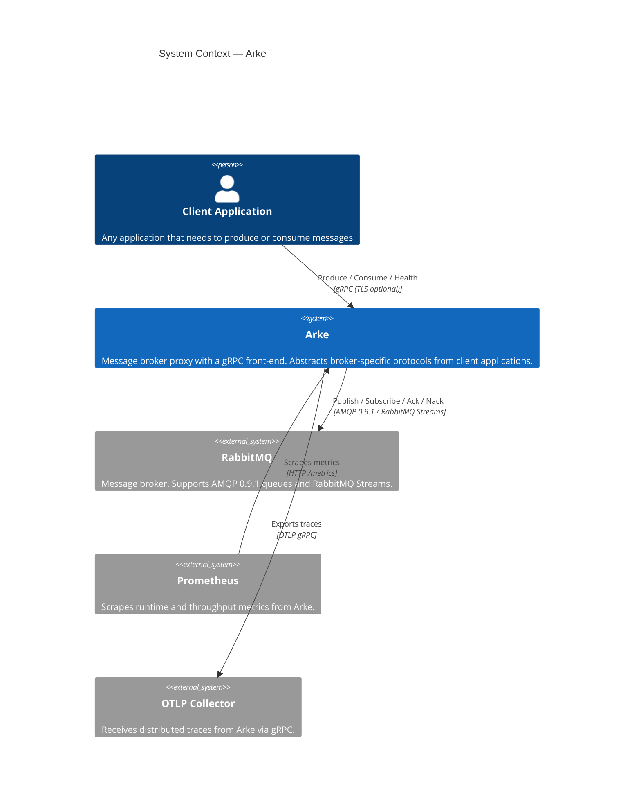
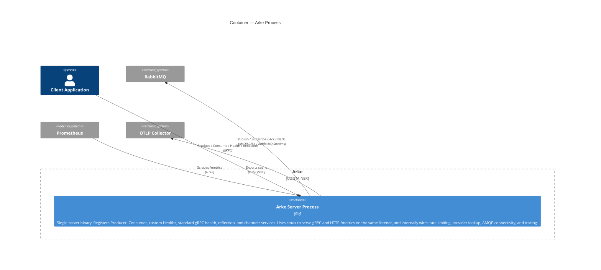
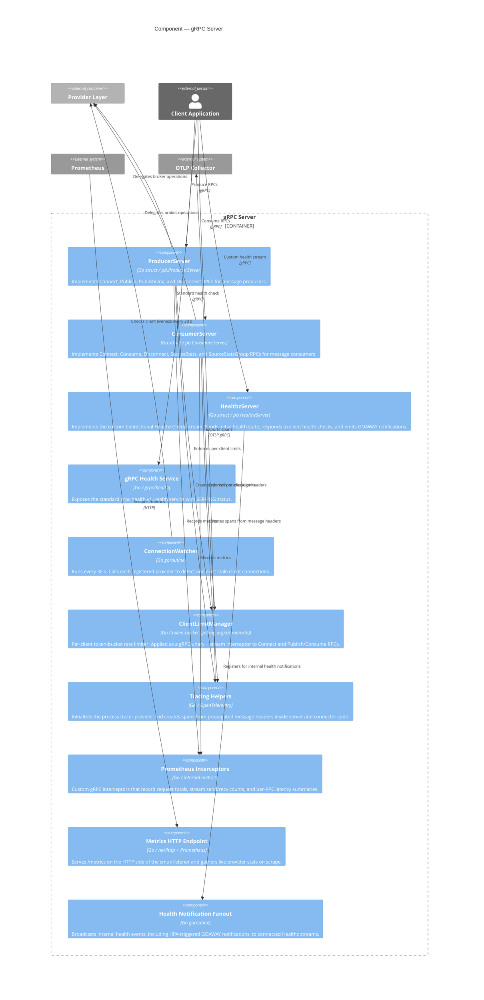
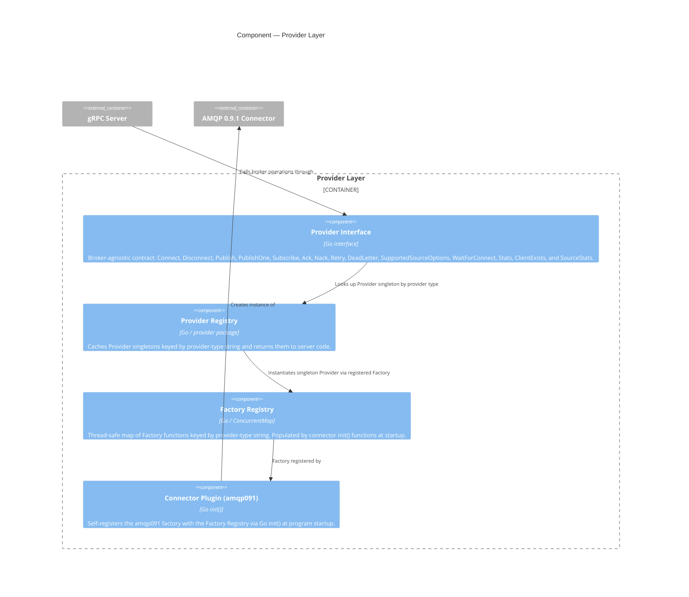
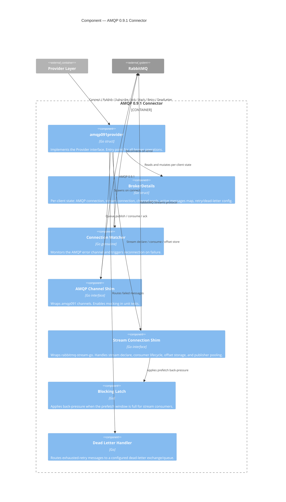
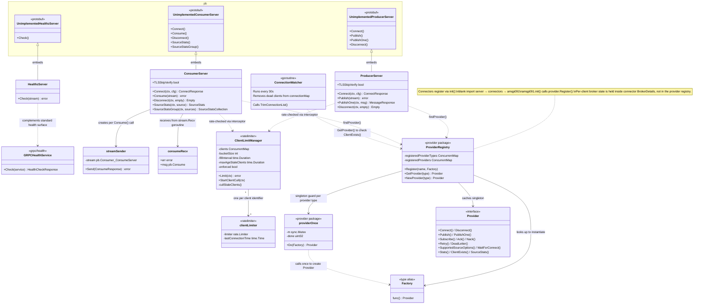

# Arke — C4 Architecture Diagrams

<!-- markdownlint-disable MD013 -->

## Level 1 — System Context

---

## Level 2 — Container

---

## Level 3 — Component (gRPC Server)

---

## Level 3 — Component (Provider Layer)

---

## Level 3 — Component (AMQP 0.9.1 Connector)

---

## Level 4a — Code (Server — gRPC Services & Provider Registry)

---

## Level 4b — Code (AMQP 0.9.1 Connector — Key Types)

```mermaid
classDiagram
    direction TB

    class Provider {
        <<interface>>
        +Connect(ctx, cfg, tlsSkipVerify) Error
        +Disconnect(ctx)
        +Publish(ctx, msgChan, errChan) Error
        +PublishOne(ctx, msg) Error
        +Subscribe(ctx, source, msgChan) Error
        +Ack(ctx, msgid) Error
        +Nack(ctx, msgid) Error
        +Retry(ctx, source, msgid, delay) Error
        +DeadLetter(ctx, source, msgid) Error
        +SupportedSourceOptions() map
        +WaitForConnect(ctx) bool
        +ClientExists(clientIdentifier) bool
        +Stats() Stats
        +SourceStats(ctx, source) SourceStats
    }

    class amqp091provider {
        -tlsConfig tls.Config
        -connections ConcurrentMap
        +Connect()
        +Publish()
        +Subscribe()
        +Ack() / Nack() / Retry() / DeadLetter()
        -queueSubscribe()
        -streamSubscribe()
        -declareExchange()
        -declareQueue()
        -declareBinding()
        -setupDeadLetter()
    }

    class BrokerDetails {
        +Connection amqp091ConnectionShim
        +StreamConnection streamConnectionShim
        +ClientIdentifier string
        +ActiveStreams int64
        -pubChannels BlockingPool
        -pubPCChannels BlockingPool
        -activeMessages ConcurrentMap
        -knownExchanges ConcurrentMap
        -knownQueues ConcurrentMap
        -knownBindings ConcurrentMap
        -state uint16
        -shutdownChan chan bool
        -lastPubSubEvent time.Time
    }

    class amqp091ConnectionShim {
        <<interface>>
        +Connect() error
        +Close() error
        +IsClosed() bool
        +NewChannel(confirm bool) amqp091ChannelShim
        +StandbyChannel() amqp091ChannelShim
        +NotifyClose(chan) chan
    }

    class amqp091Connection {
        -connection amqp.Connection
        -connStr string
        -standbyChannel amqp091Channel
        +Connect()
        +NewChannel()
        +StandbyChannel()
    }

    class amqp091ChannelShim {
        <<interface>>
        +Publish(exchange, key, msg) error
        +Consume(queue, autoAck, exclusive) chan
        +QueueDeclare(name, durable, autoDelete, args) error
        +ExchangeDeclare(name, kind, durable) error
        +QueueBind(queue, key, exchange, args) error
        +SetPrefetch(count) error
        +Close() error
        +NotifyClose(chan) chan
    }

    class amqp091Channel {
        -channel amqp.Channel
        -connection amqp091Connection
        -prefetch int
        -confirm bool
        +Publish()
        +Consume()
        +QueueDeclare()
    }

    class streamConnectionShim {
        <<interface>>
        +Connect() error
        +Close() error
        +IsClosed() bool
        +NewConsumer(stream, consumer, offset, handler, singleActive) streamConsumerShim
        +DeclareStream(name, ttl) error
        +GetPublisher(stream, name, confirm) streamPublisherShim
        +PutPublisher(confirm, publisher)
        +StoreOffset(stream, consumer, offset) error
        +GetLastOffset(stream, consumer) int64
    }

    class streamConnection {
        -env stream.Environment
        -publishers ConcurrentMap
        -clientIdentifier string
        +NewConsumer()
        +DeclareStream()
        +StoreOffset()
        +GetPublisher() / PutPublisher()
    }

    class streamConsumerShim {
        <<interface>>
        +Close() error
    }

    class streamConsumer {
        -consumer ha.ReliableConsumer
        -streamName string
        -consumerName string
        +Close()
    }

    class streamPublisherShim {
        <<interface>>
        +Publish(msg) error
        +Close() error
        +GetStreamName() string
        +GetPublisherName() string
        +GetPCChannel() chan
    }

    class streamPublisher {
        -publisher ha.ReliableProducer
        -streamName string
        -publisherName string
        -pcChannel chan
        +Publish()
        +Close()
    }

    class streamMessage {
        +Body []byte
        +Headers map
        +ContentType string
        +Ack func()
        +Nack func()
        +PublishID int64
    }

    Provider <|.. amqp091provider : implements
    amqp091provider "1" --> "n" BrokerDetails : manages per-client

    BrokerDetails --> amqp091ConnectionShim : Connection
    BrokerDetails --> streamConnectionShim : StreamConnection

    amqp091ConnectionShim <|.. amqp091Connection : implements
    amqp091Connection --> amqp091ChannelShim : creates
    amqp091ChannelShim <|.. amqp091Channel : implements

    streamConnectionShim <|.. streamConnection : implements
    streamConnection --> streamConsumerShim : creates
    streamConnection --> streamPublisherShim : manages pool
    streamConsumerShim <|.. streamConsumer : implements
    streamPublisherShim <|.. streamPublisher : implements

    streamConnection ..> streamMessage : publishes
    amqp091Channel ..> streamMessage : delivers
```

<!-- markdownlint-enable MD013 -->
