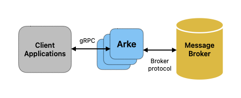

# Architecture Overview

## Purpose

This document describes the high-level architecture of Arke — a gRPC
message broker proxy. It is intended for engineers who are new to the
codebase, contributors evaluating where a change belongs, and operators
who need to understand what runs in production.

---

## System Context

Arke sits between application clients and a backend message broker.
Clients speak a single, broker-agnostic gRPC protocol; Arke translates
that into broker-native wire protocol on the backend.



---

## Internal Component Map

<!-- markdownlint-disable MD013 -->
```text
cmd/serve.go  ──────────────────────────────────────────────────────────
                 │
                 │  builds and starts
                 ▼
pkg/arke/arke.go  (Arke struct)
  ├── Build()       – wires gRPC interceptor chains
  └── Serve()       – creates listener, registers services, starts mux
         │
         ├── cmux.CMux  ──────────────────────────────────────────────────
         │       ├── HTTP/1.1 path  →  internal/metrics/prometheus (Prometheus)
         │       └── gRPC path      →  grpc.Server
         │
         ├── grpc.Server
         │       ├── ProducerServer   (internal/server)
         │       ├── ConsumerServer   (internal/server)
         │       ├── HealthzServer    (internal/server)
         │       └── health.Server    (grpc/health/v1)
         │
         ├── Interceptors (applied in Build())
         │       ├── OpenTelemetry tracing  (internal/util/tracing)
         │       ├── Prometheus metrics     (internal/server/prometheus)
         │       └── Rate limiter           (internal/server/ratelimiter)
         │
         ├── HPA monitor  (internal/util)
         │       └── broadcasts HealthStatus_Code to HealthzServer streams
         │
         └── TracerProvider  (go.opentelemetry.io/otel/sdk/trace)
                 └── exports to OTLP gRPC collector

internal/server/server.go
  ├── brokerConnect()     – resolves provider, persists connection in connectionMap
  ├── connectionWatcher() – background loop that evicts dead connections
  ├── ProducerServer.Publish / PublishOne
  ├── ConsumerServer.Consume
  └── HealthzServer.Check

internal/provider/
  ├── provider.go         – Provider interface + Registry
  └── connectors/
        └── amqp091/      – AMQP 0.9.1 implementation (RabbitMQ classic + Streams)
```
<!-- markdownlint-enable MD013 -->

---

## Key Design Decisions

### gRPC API

Arke exposes a gRPC API rather than REST or a broker-native SDK for
two primary reasons:

- **Performance.** gRPC uses HTTP/2 — multiplexed streams over a single
  TCP connection, binary-encoded Protocol Buffers, and header
  compression. This reduces latency and connection overhead compared to
  repeated HTTP/1.1 requests, which matters for high-throughput
  publish/consume workloads.
- **Portable clients.** The `.proto` definition in
  `api/protobuf-spec/arke.proto` is the single source of truth. Client
  stubs can be generated for any language supported by `protoc` (Go,
  Java, Python, C#, Node.js, etc.) without writing custom serialization
  or transport code. This means switching the client language requires
  only regenerating the stub — the application logic remains unchanged.

As a secondary benefit, gRPC's built-in service reflection (registered
in `Serve()`) lets operators introspect the live API with tools like
`grpcurl` without consulting the proto file directly.

### Single-Port Multiplexing

Arke serves gRPC and Prometheus HTTP on one TCP port using
[`cmux`](https://github.com/soheilhy/cmux). The mux dispatches
connections based on HTTP/1.1 sniffing; everything else is treated as
gRPC (HTTP/2). This simplifies firewall rules and service mesh
configuration in Kubernetes.

### Pluggable Provider Model

The `internal/provider.Provider` interface decouples server logic from
broker protocol. New broker backends (e.g. Kafka, MQTT) require only:

1. A struct implementing `Provider`.
2. A `connectors/` package that calls `provider.Register()` in its `init()`.
3. A blank import of that package in `cmd/serve.go` or `pkg/arke/arke.go`.

See [Provider/Connector Interface Contract](./provider-connector-interface.md)
for details.

### Session Affinity via `connectionMap`

Each connected client receives a unique identifier (`clientIdentifier`,
derived from the gRPC peer address). For the duration of a session, the
client's `ConnectionConfiguration` and broker-side state are anchored to
that identifier. Multiple RPCs from the same client reuse the same
backend broker connection.

### Kubernetes HPA Awareness

A background goroutine (`util.MonitorHPA`) watches the Kubernetes HPA
for the `arke` deployment. When the HPA signals a scale-up, the
goroutine emits a `GOAWAY` `HealthStatus_Code` onto an internal channel,
which is broadcast to all connected `Healthz` stream clients. Clients
are expected to reconnect, spreading load across new replicas.

---

## Data Flow: Publish

<!-- markdownlint-disable MD013 -->
> For a detailed trace of every phase — including error paths, goroutine
> topology, the ack/nack state machine, and the GOAWAY flow — see
> [Connection and Message Lifecycle](./connection-message-lifecycle.md).

```text
Client                    Arke                         Broker
  │                         │                              │
  ├── Connect(cfg) ────────►│                              │
  │◄── ConnectResponse ─────┤                              │
  │                         ├── provider.Connect(cfg) ────►│
  │                         │◄── (connected) ───────────── │
  │                         │                              │
  ├── Publish(stream) ─────►│                              │
  │   [Message, Message...] │                              │
  │                         ├── prov.Publish(msgChan) ────►│
  │◄── MessageResponse ─────┤                              │
```
<!-- markdownlint-enable MD013 -->

## Data Flow: Consume

<!-- markdownlint-disable MD013 -->
```text
Client                    Arke                         Broker
  │                         │                              │
  ├── Connect(cfg) ────────►│                              │
  │◄── ConnectResponse ─────┤                              │
  │                         ├── provider.Connect(cfg) ────►│
  │                         │◄── (connected) ──────────────│
  │                         │                              │
  ├── Consume(stream) ─────►│                              │
  │   [Source{...}]         │                              │
  │                         ├── prov.Subscribe(src, ch) ──►│
  │◄── ConsumeResponse ─────┤◄── messages via ch ───────── │
  │   [Message]             │                              │
  │                         │                              │
  ├── Consume(stream) ─────►│  (Ack/Nack inline)           │
  │   [Ack{uuid}]           │                              │
  │                         ├── prov.Ack(uuid) ───────────►│
  │◄── ConsumedResponse ────┤                              │
```
<!-- markdownlint-enable MD013 -->

---

## Repository Structure Summary

<!-- markdownlint-disable MD013 -->
| Path | Purpose |
| --- | --- |
| `api/` | Generated protobuf Go bindings + proto spec (see [Protocol Reference](../arke_protocol.md)) |
| `cmd/` | `main` package – parses flags, wires and starts `Arke` |
| `pkg/arke/` | Public `Arke` struct; server lifecycle, TLS, rate-limit wiring |
| `internal/server/` | gRPC service implementations (Producer, Consumer, Healthz) |
| `internal/provider/` | `Provider` interface and registry |
| `internal/provider/connectors/` | Broker-specific implementations |
| `internal/metrics/` | Prometheus metric definitions and HTTP server |
| `internal/util/` | Logger, HPA monitor, process stats, tracing init |
| `i18n/` | Translated/parameterized log message IDs |
| `test/` | Shared test helpers (connection util, config, message functions) |
| `tests/integration/` | Docker-Compose based integration test suite |
| `doc/` | Protocol reference and design documents |
<!-- markdownlint-enable MD013 -->

---

## Related Design Documents

<!-- markdownlint-disable MD013 -->
| Document | Description |
| --- | --- |
| [Connection and Message Lifecycle](./connection-message-lifecycle.md) | Detailed session phases, goroutine topology, ack/nack decision tree, and GOAWAY propagation |
| [Provider/Connector Interface Contract](./provider-connector-interface.md) | `Provider` interface contract and guide for adding new broker backends |
| [Deployment and Operations Runbook](./deployment-operations-runbook.md) | Full environment variable reference, Kubernetes deployment checklist, observability, and troubleshooting |
| [Protocol Reference](../arke_protocol.md) | Auto-generated reference for all protobuf messages, fields, enums, and gRPC service methods |
<!-- markdownlint-enable MD013 -->
